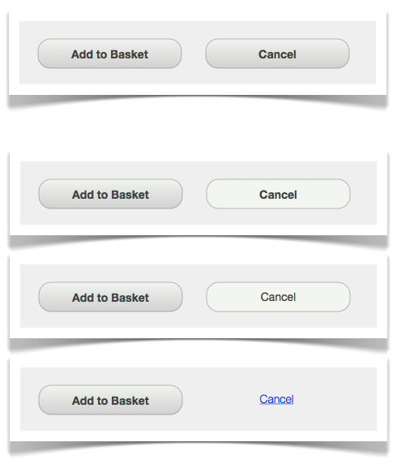
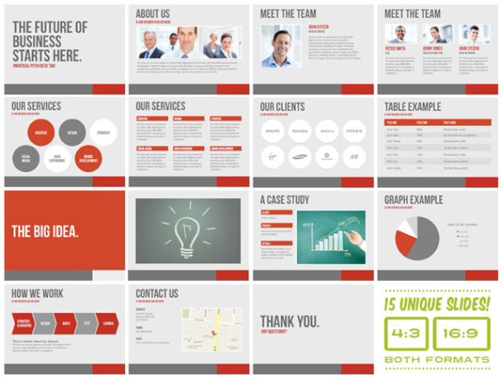
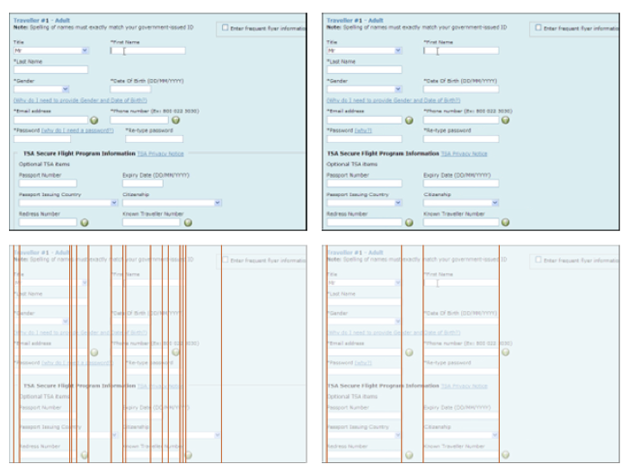
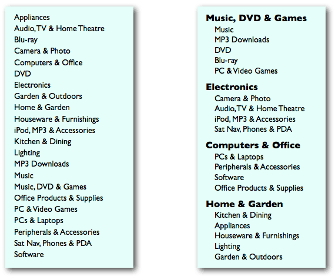

#HSLIDE

# SCRAP Your UI
## to delight your users

<strong>Rick Beddard</strong> - 2016.02.16

#HSLIDE

## What we'll learn...

- What UI is (for this presentation) <!-- .element: class="fragment" -->
- 5 attributes that are key to a beautiful UI <!-- .element: class="fragment" -->
- Reasons why these attributes are important <!-- .element: class="fragment" -->

#HSLIDE

## What we won't learn...

- Typography
- Color
- Texture
- Lines and shapes
- Scale
- Dominance and emphasis
- Balance
- Harmony
- Etc...

#HSLIDE

## What do you mean by UI

- User interface
- Visual layout
- Styling

#HSLIDE

## SCRAP

It's an acronym which stands for...

- Spacing <!-- .element: class="fragment" --> 
- Contrast <!-- .element: class="fragment" -->
- Repetition <!-- .element: class="fragment" -->
- Alignment <!-- .element: class="fragment" -->
- Proximity <!-- .element: class="fragment" -->

#HSLIDE

## CRAP Evolved

Robin Williams (the designer, not the actor) coined the acronym <b>CRAP</b> in her aptly-named book <i>The Non-Designer's Design Book</i> (now in its 4th edition)

#HSLIDE

## Don't Make Me Think

You'll notice as we talk about of these basic design principles, that they all reduce the mental strain of the user.

Here is where I plug Steve Krug's fantastic book titled <i>Don't Make Me Think</i>. This book is a must-read if you're involved in any way with user interfaces.

#HSLIDE

## Spacing

Area around interface elements

- Usually have too little (visual suffocation)
- Used to both group and separate
- Affects legibility, noise, etc.

#HSLIDE

## Spacing - Example

https://www.google.com

## Spacing - Elements

- Margin
- Padding
- Type (character) spacing
- Line spacing
- Etc.

#HSLIDE

## Contrast

Difference between interface elements

- Most important visual attraction
- Avoid similar (subtly different) elements
- Different elements should be very different

#HSLIDE

## Contrast - Example

http://www.userfocus.co.uk/articles/A_CRAP_way_to_improve_usability.html

#HSLIDE

## Contrast - Elements

- Color
- Type
- Size
- Line thickness
- Space
- Etc.

#HSLIDE

## Repetition

Consistency among interface elements

- Can occur in a page or across pages
- Can occur across products
- Creates feel of cohesion and unity
- Increases perceived credibility (purposeful)

#HSLIDE

## Repetition - Example

https://vwo.com/blog/crap-design-principles/

## Repetition - Elements

- Colors
- Icons
- Shapes
- Fonts
- Sizes
- Spacing
- Locations
- Etc.

#HSLIDE

## Alignment

Connections between interface elements

- Never arbitrary
- Every element visually connected to another
- Creates a clean, sophisticated, fresh look

#HSLIDE

## Alignment - Example

http://www.userfocus.co.uk/articles/A_CRAP_way_to_improve_usability.html

## Alignment - Elements

- Grids
- Rows
- Columns
- Borders
- Text
- Icons
- Etc.

#HSLIDE

## Proximity

Grouping related interface elements

- Multiple elements become one visual unit
- Organizes information
- Presents clear structure
- Increases perceived credibility (purposeful)
- Reduces noise

#HSLIDE

## Proximity - Example

http://www.userfocus.co.uk/articles/A_CRAP_way_to_improve_usability.html

#HSLIDE

## Questions?

#HSLIDE

## References

- The Non-Designer's Design Book, Robin Williams
- Don't Make Me Think, Steve Krug
- http://www.userfocus.co.uk/articles/A_CRAP_way_to_improve_usability.html
- https://vwo.com/blog/crap-design-principles/

#HSLIDE

## About the Author

Rick Beddard is a Technology Aficionado (yes, I had to look up that spelling) located in Richmond, Virginia. He spends his days changing lives through his work at Unboxed Technology and his nights pursuing highly important endeavors such as being a husband and father.

#HSLIDE

(This page left intentionally blank. Except that it's not. Blank, that is.)

#HSLIDE

## The End
